# Song2Learn Architecture

> Technical reference for the Song2Learn platform

---

## System Overview

Song2Learn is a language learning platform that transforms song lyrics into interactive learning experiences. The system follows a **clean architecture** pattern with clear separation between layers.

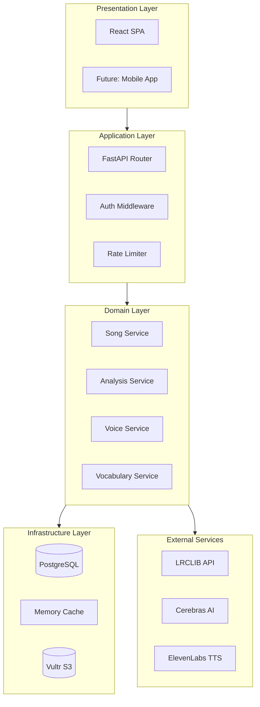

---

## Component Architecture

### Backend Services

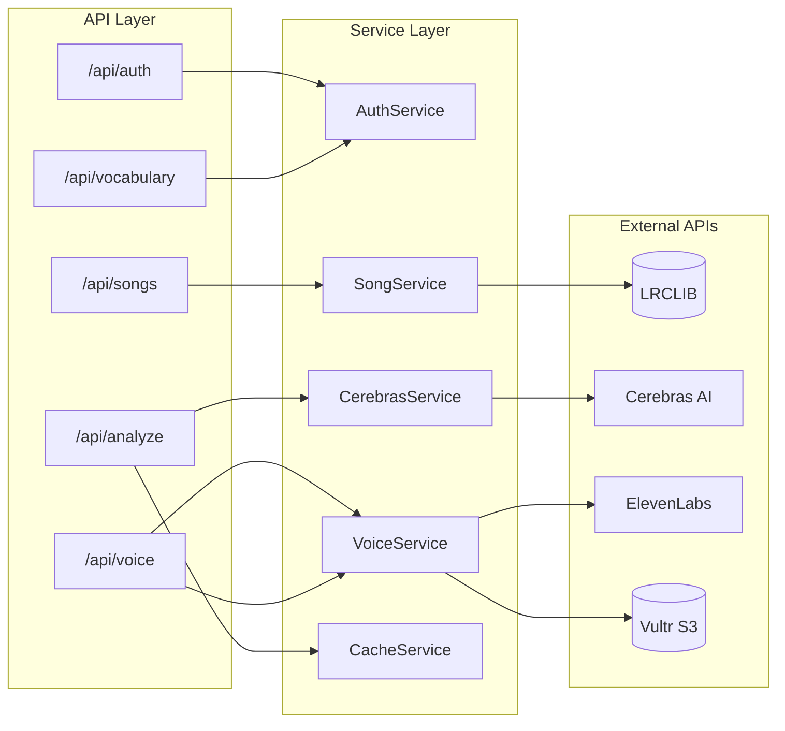

### Frontend Architecture

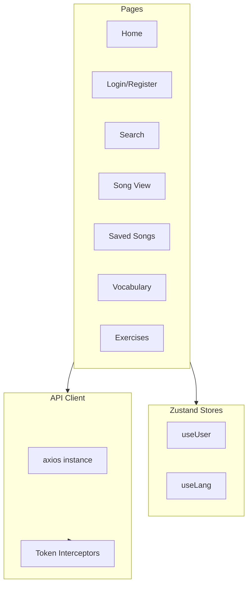

---

## Data Flow

### Song Import Flow

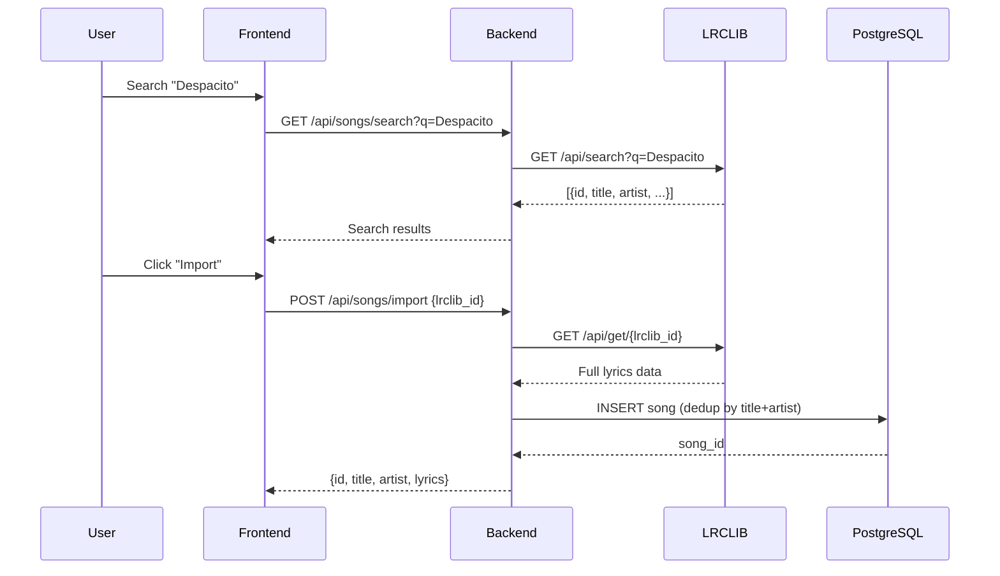

### Lyric Analysis Flow

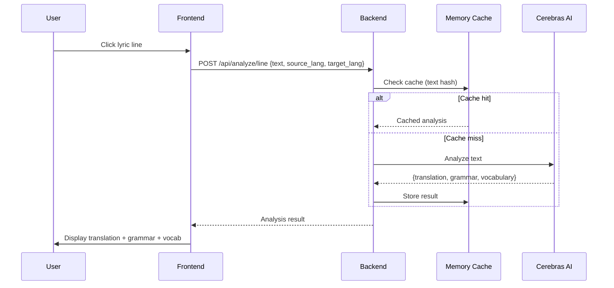

### TTS Audio Flow

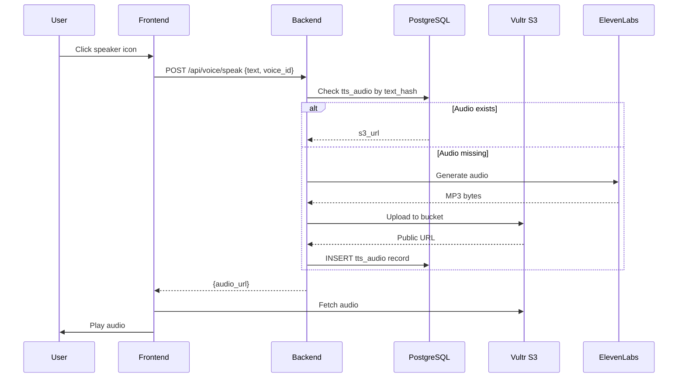

---

## Security Model

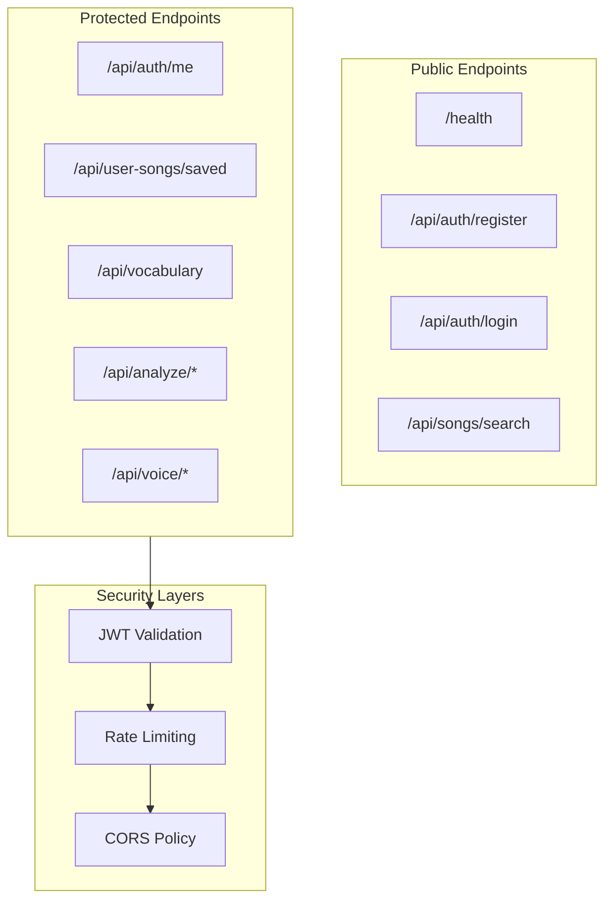

### Authentication Tokens

| Token | Purpose | Lifetime |
|-------|---------|----------|
| Access Token | API authorization | 15 minutes |
| Refresh Token | Obtain new access token | 30 days |

### Rate Limits

| Endpoint | Limit | Window |
|----------|-------|--------|
| `/api/analyze/*` | 60 | 1 minute |
| `/api/voice/*` | 20 | 1 minute |

---

## Database Schema

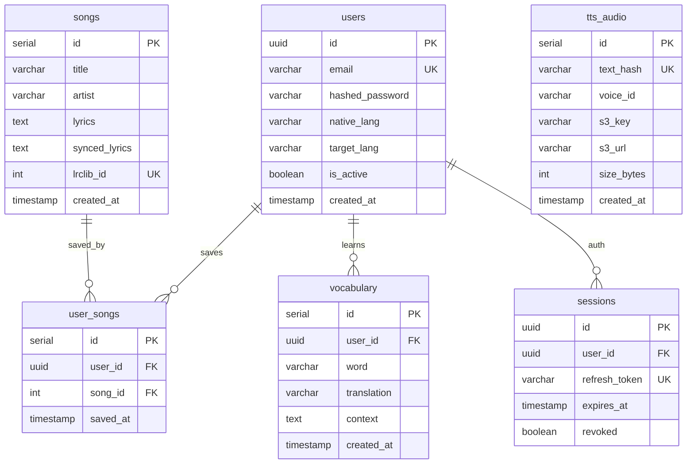

---

## Infrastructure

### Deployment Topology

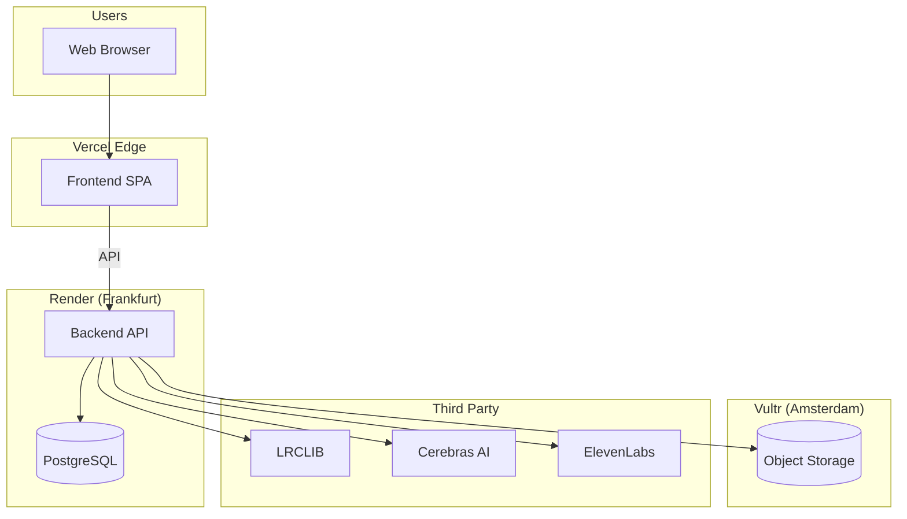

### Docker Services

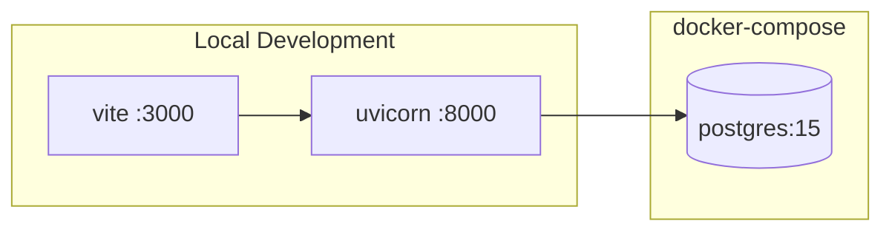

---

## Caching Strategy

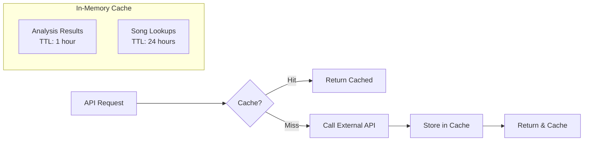

---

## Error Handling

| HTTP Code | Meaning | Action |
|-----------|---------|--------|
| 400 | Bad Request | Invalid input, check payload |
| 401 | Unauthorized | Token expired/invalid, refresh |
| 403 | Forbidden | Missing permissions |
| 404 | Not Found | Resource doesn't exist |
| 429 | Too Many Requests | Rate limited, wait and retry |
| 500 | Internal Error | Server issue, check logs |

---

## Future Considerations

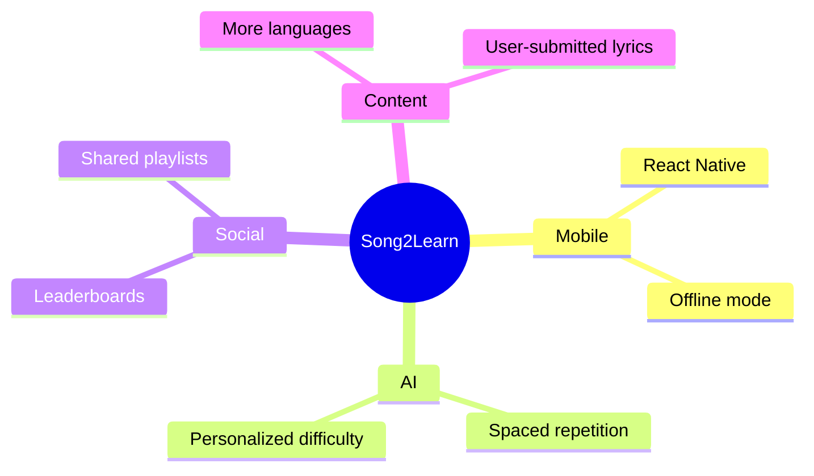
